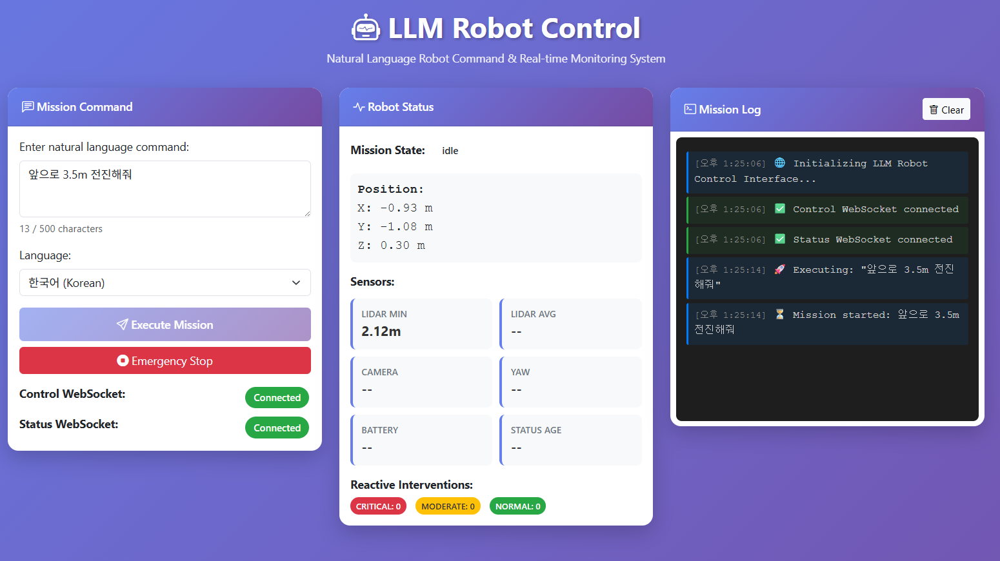

# LLM Robot Control System (LLM_ROBOT_2)

A production-ready robot control platform combining CrewAI multi-agent systems, reactive control, and web-based natural language interfaces for intelligent robot operations.



> Web control interface: enter a natural-language mission command, monitor real-time robot status and sensors, and watch the live mission log.

## Project Overview

LLM_ROBOT_2 is a comprehensive robot control system that enables natural language mission commands through a multi-agent AI architecture. The system integrates planning, execution, verification, and reactive control with real-time web-based monitoring and control.

**Key Features:**
- 🤖 **Multi-Agent Control System**: CrewAI-powered Planner, Actor, and Verifier agents
- 🧠 **Hybrid Reactive Controller**: Real-time obstacle avoidance with Ollama LLM integration
- 🌐 **Web Control Interface**: FastAPI + WebSocket for remote robot control
- 📡 **Real-time Monitoring**: 10Hz status broadcasting with live sensor data
- 🛡️ **Safety Constraints**: Automated safety checks and failure recovery
- 📊 **RAG System**: ChromaDB-powered knowledge base for context-aware decision making
- 🔄 **Failure Recovery**: Intelligent replanning on mission failures

## System Architecture

```
┌─────────────────┐
│   Web Browser   │ ← User enters natural language command
└────────┬────────┘
         │ WebSocket (/ws/control)
         ▼
┌────────────────────────────────────────┐
│   FastAPI Web Server (Story 3.2)      │
│  - REST API (/api/mission, /api/status)│
│  - WebSocket (10Hz status broadcast)   │
└────────┬───────────────────────────────┘
         │
         ▼
┌────────────────────────────────────────┐
│   Mission Orchestrator                 │
│  - Coordinates agent workflow          │
│  - Manages mission lifecycle           │
│  - Integrates reactive controller      │
└────────┬───────────────────────────────┘
         │
    ┌────┴────┬────────────┬──────────┐
    ▼         ▼            ▼          ▼
┌────────┐ ┌────────┐ ┌──────────┐ ┌────────────┐
│Planner │ │ Actor  │ │ Verifier │ │  Reactive  │
│ Agent  │ │ Agent  │ │  Agent   │ │ Controller │
└────┬───┘ └───┬────┘ └────┬─────┘ └─────┬──────┘
     │         │            │             │
     │    ┌────┴────┐       │             │
     │    ▼         ▼       ▼             ▼
     │  Webots  ChromaDB  Safety      Ollama
     │  Robot     RAG    Constraints  (tinyllama)
     └─────────────────────────────────────┘
```

## Quick Start

### Prerequisites

- Python 3.10+
- Webots R2023b+ (robot simulation)
- Ollama (for reactive control, Story 3.1)
- OpenAI API key (for Planner/Actor agents)

### Installation

1. **Clone the repository**:
```bash
git clone <repository-url>
cd LLM_robot_2
```

2. **Install dependencies**:
```bash
pip install -r requirements.txt
```

3. **Set up environment variables**:
```bash
# Create .env file
cp .env.template .env

# Edit .env with your configuration:
# OPENAI_API_KEY=sk-...
# WEBOTS_PATH=C:\Program Files\Webots
# SERVER_PORT=8000
# SERVER_HOST=127.0.0.1
```

4. **Install and start Ollama** (for reactive control):
```bash
# On Linux/Mac:
curl -fsSL https://ollama.com/install.sh | sh

# On Windows: Download from https://ollama.com/download

# Pull tinyllama model:
ollama pull tinyllama

# Verify Ollama is running:
curl http://localhost:11434/api/tags
```

5. **Run tests** (optional):
```bash
pytest tests/ -v
```

### Running the System

#### Option 1: Web Control Interface (Recommended)

Start the FastAPI web server for browser-based control:

```bash
# Start the web server
uvicorn src.web.server:app --reload --host 127.0.0.1 --port 8000

# Open your browser:
# http://localhost:8000
```

The web UI provides:
- Natural language command input (Korean/English)
- Real-time robot position and sensor status
- Live mission log with reactive interventions
- WebSocket-based status updates (10Hz)

#### Option 2: Direct Python Execution

```bash
# Start Webots simulation first (open worlds/robot_world.wbt)

# Run mission directly
python src/main.py

# Or use interactive mode
python -c "from src.orchestrator import MissionOrchestrator; orch = MissionOrchestrator(); orch.execute_mission_interactive()"
```

## Web Control Server

### Features

**Real-time Control:**
- WebSocket connection for bidirectional communication
- Natural language command submission
- 10Hz (100ms) status updates to all connected clients
- Concurrent multi-client support (10+ connections)

**REST API Endpoints:**
| Method | Path | Description |
|--------|------|-------------|
| POST | `/api/mission` | Execute mission command (async) |
| GET | `/api/status` | Get current robot status |
| GET | `/health` | Server health check |
| GET | `/docs` | Swagger UI (API documentation) |
| GET | `/` | Web UI (index.html) |

**WebSocket Endpoints:**
| Path | Direction | Description |
|------|-----------|-------------|
| `/ws/control` | Bidirectional | Submit commands and receive mission results |
| `/ws/robot-status` | Server → Client | Real-time status broadcasting (10Hz) |

### Installation Requirements

```bash
# Web server dependencies (included in requirements.txt)
pip install fastapi>=0.104.0
pip install uvicorn[standard]>=0.24.0
pip install websockets>=12.0
pip install python-socketio>=5.10.0
```

### Usage Examples

**Starting the Server:**
```bash
# Development mode (auto-reload)
uvicorn src.web.server:app --reload --host 127.0.0.1 --port 8000

# Production mode (with workers)
uvicorn src.web.server:app --host 0.0.0.0 --port 8000 --workers 4
```

**Accessing the Web UI:**
```
http://localhost:8000
```

**Natural Language Command Examples:**
- "3미터 전진하세요" (Move forward 3 meters)
- "90도 왼쪽으로 회전하세요" (Rotate 90 degrees left)
- "장애물을 회피하며 5미터 전진하세요" (Move forward 5 meters while avoiding obstacles)
- "안전하게 목표 지점으로 이동하세요" (Navigate to target point safely)

**WebSocket Protocol:**

*Command Submission (Client → Server)*:
```json
{
  "command": "장애물을 회피하며 5미터 전진하세요",
  "language": "ko",
  "priority": 5
}
```

*Mission Response (Server → Client)*:
```json
{
  "success": true,
  "message": "Mission completed successfully",
  "duration_seconds": 12.5,
  "final_position": [5.0, 0.0, 0.0],
  "reactive_events": [
    {
      "timestamp": "2025-11-03T10:30:45.123Z",
      "intervention_type": "MODERATE",
      "reason": "Obstacle at 0.35m",
      "action_taken": "DETOUR"
    }
  ]
}
```

*Status Broadcast (Server → Client, 10Hz)*:
```json
{
  "position": [2.5, 0.1, 0.0],
  "sensors": {
    "lidar_min": 0.45,
    "lidar_avg": 1.2,
    "camera_has_data": true,
    "yaw": 45.0,
    "battery": 85.0
  },
  "mission_state": "executing",
  "reactive_log_summary": {
    "CRITICAL": 0,
    "MODERATE": 2,
    "NORMAL": 10
  },
  "timestamp": "2025-11-03T10:30:45.123Z"
}
```

**Integrating with Python Code:**

```python
from src.web.server import app, set_orchestrator
from src.orchestrator import MissionOrchestrator
import threading
import uvicorn

# Initialize orchestrator
orchestrator = MissionOrchestrator()

# Register orchestrator with web server
set_orchestrator(orchestrator)

# Start server in background thread
def run_server():
    uvicorn.run(app, host="127.0.0.1", port=8000)

server_thread = threading.Thread(target=run_server, daemon=True)
server_thread.start()

# Now web UI is accessible at http://localhost:8000
print("Web server running at http://localhost:8000")
```

### Troubleshooting

**WebSocket Connection Failures:**
- Ensure server is running: `curl http://localhost:8000/health`
- Check firewall allows port 8000
- Verify WebSocket URL uses correct protocol (ws:// for HTTP, wss:// for HTTPS)
- Check browser console for connection errors

**CORS Issues:**
- Web UI served from same origin (localhost:8000) - no CORS needed
- If using external frontend, update CORS origins in `src/web/server.py`

**Orchestrator Not Initialized:**
- Server returns HTTP 503 if orchestrator not set
- Call `set_orchestrator(orch)` before making API requests
- Web UI will show "Orchestrator not initialized" in status panel

**Status Broadcasting Not Working:**
- Verify orchestrator is initialized
- Check WebSocket connection status in browser
- Broadcasting starts automatically when orchestrator is set
- Send `{"action": "start_broadcasting"}` via WebSocket to toggle

### Performance Targets

- WebSocket message latency: <50ms (server → client)
- REST API response time: <500ms for `/api/mission`
- Status broadcast frequency: 10Hz (100ms intervals)
- Concurrent connections: 10+ WebSocket clients supported

### Security Note

**This is a development server. For production deployment:**
- Enable SSL/TLS (use reverse proxy like nginx)
- Implement authentication/authorization
- Restrict CORS origins
- Use environment-specific configuration
- Deploy with process manager (systemd, supervisor)
- Configure firewall rules

## Project Structure

```
LLM_robot_2/
├── src/
│   ├── agents/              # Multi-agent system (Planner, Actor, Verifier)
│   ├── schemas/             # Pydantic data models
│   ├── rag/                 # ChromaDB RAG system
│   ├── sensors/             # Sensor integration and noise filtering
│   ├── reactive/            # Hybrid reactive controller (Story 3.1)
│   ├── web/                 # FastAPI web server (Story 3.2)
│   │   ├── server.py        # FastAPI app, WebSocket handlers, REST endpoints
│   │   ├── schemas.py       # MissionRequest, MissionResponse, SystemStatus
│   │   └── templates/       # Web UI (index.html)
│   ├── orchestrator.py      # Mission coordinator
│   └── main.py              # Entry point
├── tests/                   # Pytest test suite
│   ├── test_*.py            # Unit tests
│   ├── integration/         # Integration tests
│   └── e2e/                 # End-to-end tests
├── worlds/                  # Webots simulation worlds
├── data/                    # Knowledge base data (RAG)
├── docs/                    # Documentation
│   ├── architecture.md      # System architecture
│   ├── epics.md             # Epic definitions
│   ├── tech-spec-epic-3.md  # Technical specifications
│   └── stories/             # Story files
├── scripts/                 # Utility scripts
│   ├── install_ollama.sh    # Ollama setup script
│   └── deploy_web_server.sh # Web server deployment
├── logs/                    # Mission logs (JSON + text)
├── .env.template            # Environment variable template
├── requirements.txt         # Python dependencies
├── pytest.ini               # Pytest configuration
└── README.md                # This file
```

## Core Components

### Multi-Agent System

**PlannerAgent** (CrewAI + GPT-4o-mini):
- Receives natural language commands
- Queries RAG knowledge base for mission-specific context
- Generates step-by-step action plans (move, rotate, scan)
- Validates plan feasibility

**ActorAgent** (CrewAI + Webots):
- Executes action plans on simulated robot
- Controls wheels, sensors, and actuators
- Integrates reactive controller for real-time obstacle avoidance
- Logs execution events

**VerifierAgent** (CrewAI):
- Validates mission completion against plan
- Checks goal achievement (position, orientation)
- Analyzes failure causes (obstacle collision, sensor failure, timeout)
- Triggers replanning if needed

### Hybrid Reactive Controller (Story 3.1)

**3-Level Decision System:**
- **CRITICAL** (< 0.2m): Emergency stop, Ollama LLM decision
- **MODERATE** (0.2-0.5m): Detour planning, speed adjustment
- **NORMAL** (> 0.5m): Continue with caution

**Features:**
- Real-time obstacle detection (64ms check interval)
- Ollama tinyllama integration for complex decisions
- Graceful degradation (falls back to rules if Ollama unavailable)
- Reactive log tracking for all interventions

### RAG Knowledge Base

- **ChromaDB** vector database
- **OpenAI text-embedding-3-small** embeddings
- 10+ curated mission examples (Korean/English)
- Metadata filtering (environment_type, difficulty)
- Top-K retrieval (K=3) for planning context

### Safety Constraints

- Battery level monitoring (abort if < 20%)
- Collision detection (lidar threshold < 0.3m)
- Workspace bounds enforcement
- Motion limits (max speed, acceleration)
- Timeout protection (30s per mission)

### Failure Recovery

- Automatic failure cause analysis (5 failure types)
- Replanning with alternative strategies
- Max 3 retry attempts
- Context preservation across retries

## Testing

```bash
# Run all tests
pytest tests/ -v

# Run specific test categories
pytest tests/test_web_api.py -v                          # Unit tests (web server)
pytest tests/integration/test_web_integration.py -v      # Integration tests
pytest tests/e2e/test_web_e2e.py -v                      # End-to-end tests

# Run with coverage
pytest tests/ -v --cov=src/web --cov-report=html

# Run Story 3.2 tests only
pytest tests/test_web_api.py tests/integration/test_web_integration.py tests/e2e/test_web_e2e.py -v
```

**Test Categories:**
- **Unit Tests**: Individual component testing (mocked dependencies)
- **Integration Tests**: WebSocket → Orchestrator → Agent flow
- **E2E Tests**: Full mission execution with Webots simulation

**Test Coverage:**
- Epic 1-2: 296+ tests (100% passing)
- Epic 3: Story 3.0 (5 tests), Story 3.1 (16 tests), Story 3.2 (pending)

## Technologies

- **AI/ML**: CrewAI, OpenAI GPT-4o-mini, Ollama (tinyllama 1.1B)
- **Web**: FastAPI, uvicorn, WebSocket, Bootstrap 5
- **Data**: Pydantic, ChromaDB, NumPy, pandas
- **Simulation**: Webots R2023b
- **Testing**: pytest, pytest-asyncio, httpx
- **Logging**: loguru, OpenLit (LLM monitoring)

## Development

### Adding New Features

1. Create story file in `docs/stories/`
2. Generate story context: `/bmad:bmm:workflows:story-context`
3. Implement with dev workflow: `/bmad:bmm:workflows:dev-story`
4. Code review: `/bmad:bmm:workflows:code-review`
5. Mark done: `/bmad:bmm:workflows:story-done`

### Code Quality Standards

- Type hints for all functions
- Docstrings (Google style)
- Pydantic for data validation
- Structured logging (loguru)
- Test coverage >80%

## Performance

**Mission Execution:**
- Planning: ~2-3s (LLM + RAG query)
- Execution: ~10-20s (depends on action complexity)
- Verification: <1s

**Reactive Control:**
- Check frequency: 64ms (15.6Hz)
- Ollama inference: P90 < 1200ms, avg < 1000ms
- Rule-based fallback: <10ms

**Web Server:**
- WebSocket latency: <50ms
- REST API response: <500ms
- Status broadcast: 10Hz (100ms)

## Epic Summary

### Epic 1: Foundation & Core Multi-Agent System ✅
- 7 stories completed
- CrewAI agents (Planner, Actor, Verifier)
- Webots integration
- Pydantic schemas
- 100+ tests passing

### Epic 2: Advanced Features, Safety & Evaluation ✅
- 5 stories completed
- ChromaDB RAG system
- Multi-sensor integration
- Safety constraints
- Failure recovery
- Monitoring & evaluation

### Epic 3: Real-time Control & Web Interface 🚧
- Story 3.0: Ollama Setup & Validation ✅
- Story 3.1: Hybrid Reactive Controller ✅
- Story 3.2: FastAPI Web Control Server 🚧 (in progress)
- Story 3.3: Environment-Aware Planning (planned)
- Story 3.4: React Web UI Dashboard (optional)
- Story 3.5: Integration Testing (planned)

## Contributors

- BMad (Project Lead)
- Claude Sonnet 4.5 (AI Development Assistant)

## License

[Add License Information]

## Support

For questions or issues:
1. Check documentation in `docs/`
2. Review story files in `docs/stories/`
3. Run tests to verify system state
4. Check mission logs in `logs/`

---

**Generated:** 2025-11-03
**Version:** 1.0.0
**Status:** Active Development (Epic 3)
